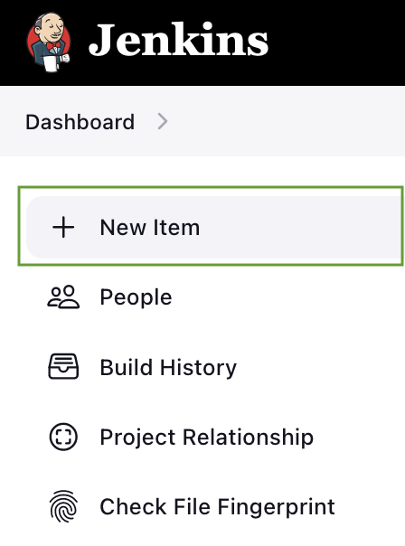
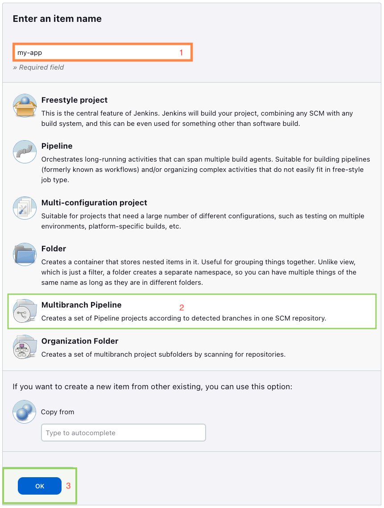
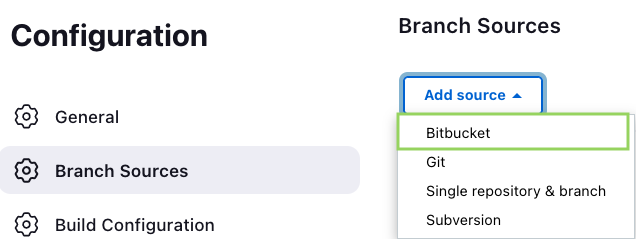
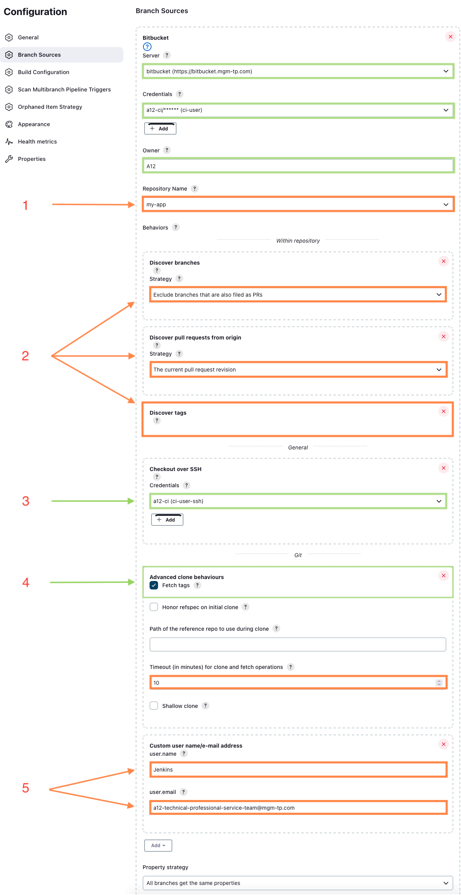
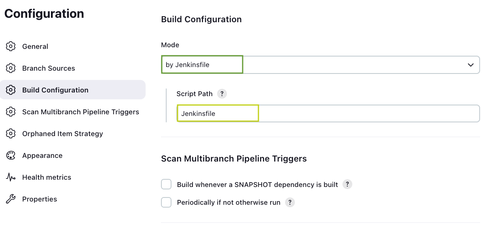
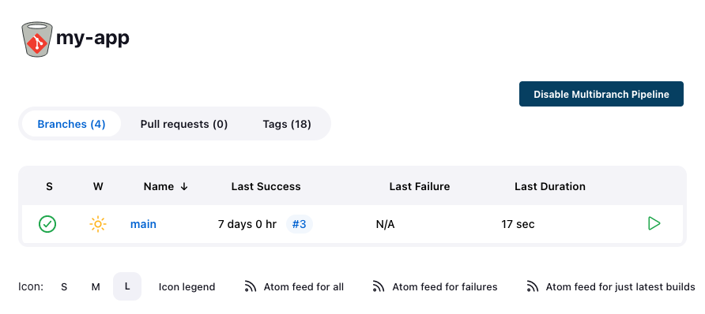

<!--- References --->
<!--- Project Template getA12 documentation links --->
[getA12]: https://docs.geta12.com/docs/#content:asciidoc,product:PROJECT_TEMPLATE,artifact:project-template-documentation,scene:Qc5TNM
[Artifactory access]: https://docs.geta12.com/docs/#content:asciidoc,product:PROJECT_TEMPLATE,artifact:project-template-documentation,scene:Qc5TNM,anchor:_gradle_configuration
[Downloads]: https://docs.geta12.com/docs/#content:asciidoc,product:project_template,artifact:project-template-documentation,scene:Qc5TNM,anchor:_downloads
[Environment and Tools Setup]: https://docs.geta12.com/docs/#content:asciidoc,product:PROJECT_TEMPLATE,artifact:project-template-documentation,scene:Qc5TNM,anchor:_environment_and_tools_setup
[Getting Started With the Project]: https://docs.geta12.com/docs/#content:asciidoc,product:PROJECT_TEMPLATE,artifact:project-template-documentation,scene:Qc5TNM,anchor:_getting_started_with_the_project
[Preparation of the Project Template for a New Project]: https://docs.geta12.com/docs/#content:asciidoc,product:PROJECT_TEMPLATE,artifact:project-template-documentation,scene:Qc5TNM,anchor:_preparation_of_the_project_template_for_a_new_project
[Build]: https://docs.geta12.com/docs/#content:asciidoc,product:PROJECT_TEMPLATE,artifact:project-template-documentation,scene:Qc5TNM,anchor:_build
[Run]: https://docs.geta12.com/docs/#content:asciidoc,product:PROJECT_TEMPLATE,artifact:project-template-documentation,scene:Qc5TNM,anchor:_run
[Development Tips]: https://docs.geta12.com/docs/#content:asciidoc,product:PROJECT_TEMPLATE,artifact:project-template-documentation,scene:Qc5TNM,anchor:_development_tips
[Deployment]: https://docs.geta12.com/docs/#content:asciidoc,product:PROJECT_TEMPLATE,artifact:project-template-documentation,scene:Qc5TNM,anchor:_deployment
[Security]: https://docs.geta12.com/docs/#content:asciidoc,product:project_template,artifact:project-template-documentation,scene:Qc5TNM,anchor:_security
[Enhancement Possibilities]: https://docs.geta12.com/docs/#content:asciidoc,product:PROJECT_TEMPLATE,artifact:project-template-documentation,scene:Qc5TNM,anchor:_enhancement_possibilities
[Working With the SME]: https://docs.geta12.com/docs/#content:asciidoc,product:PROJECT_TEMPLATE,artifact:project-template-documentation,scene:Qc5TNM,anchor:_working_with_the_sme
[Data Migration Support]: https://docs.geta12.com/docs/#content:asciidoc,product:PROJECT_TEMPLATE,artifact:project-template-documentation,scene:Qc5TNM,anchor:_data_migration_support
[Document Ownership]: https://docs.geta12.com/docs/#content:asciidoc,product:PROJECT_TEMPLATE,artifact:project-template-documentation,scene:Qc5TNM,anchor:_document_ownership
[Configuration]: https://docs.geta12.com/docs/#content:asciidoc,product:project_template,artifact:project-template-documentation,scene:Qc5TNM,anchor:configuration_profiles
[Variants]: https://docs.geta12.com/docs/#content:asciidoc,product:PROJECT_TEMPLATE,artifact:project-template-documentation,scene:Qc5TNM,anchor:_variants

<!--- other links ---> 
[Helm A12 Stack charts]: https://docs.geta12.com/docs/#product:build_and_deployment,artifact:a12-stack,content:asciidoc,scene:Xv9cKv
[A12 Jenkins Deployment Pipelines]: https://docs.geta12.com/docs/#product:build_and_deployment,artifact:a12-pipelines-doc,content:asciidoc,scene:6w0lCy
[JDK]: https://adoptopenjdk.net/
[Gradle]: https://docs.gradle.org/
[Docker]: https://hub.docker.com/
[Node]: https://nodejs.org/en/docs/
[npm]: https://docs.npmjs.com/about-npm
[npm semver]: https://github.com/npm/node-semver
<!--- End of References --->

# Project Template
Use this template to quickstart your A12-based project. For more information about the Project Template and how to get started, check out the detailed documentation on [getA12].

## Content
- [Introduction](#introduction)
- [Prerequisites](#prerequisites)
- [Documentation](#documentation)
- [Quickstart](#quickstart)
- [Jenkins Pipelines](#jenkins-pipelines)
    - [Overview](#overview)
    - [Pipeline Preparation](#pipeline-preparation)
    - [Creating Job in Jenkins](#creating-job-in-jenkins)

## Introduction
By default, template services are exposed on the following ports:

| Service                 | Port      | Note        |
|-------------------------|-----------|-------------|
| Frontend                | ``:8081`` |             |
| Project Template Server | ``:8082`` |             |
| Postgres                | ``:8083`` | Docker only |
| Keycloak                | ``:8089`` | Docker only |

## Prerequisites
Proper environment setup is crucial for the successful build and run of this project. Please follow the steps in the [environment and tools setup] documentation carefully.

To wrap up, the following [tools](./tool-versions.json) are required to build this project. Versions are maintained in `./tool-versions.json` file and follow [npm semver] versioning patterns.

<!--- VERSION_TABLE_START (Edit versions in tool-versions.json, not here. Do not delete this tag.) --->
| Tool                 | Version      | Note |
|----------------------|--------------|------|
| [JDK]                | '21'         |      |
| [Gradle]1 | '>=8.5.x <9' |      |
| [Node]               | '22.x.x'     |      |
| [npm]1    | '>=10.7.x'   |      |
| [Docker]1 | '>=20.x'     |      |
| [Docker Compose]     | '>=2.20.3'   |      |
<!--- VERSION_TABLE_END (Edit versions in tool-versions.json, not here. Do not delete this tag.) --->

1) These tools have to be configured to use proper Artifactory. Please, follow [Artifactory access] documentation to set it up.

## Documentation
You can find the details on all topics in the [geta12] Project Template documentation with links to the direct access below:

- **[Downloads]** - List of the Project Template artifacts downloadable in different variants.
- **[Environment and Tools Setup]** - Details on setting up Gradle, Node & npm, Docker and Java tools, setting their access to the specific Artifactory and some troubleshooting tips.
- **[Getting Started With the Project]** - Description of the structure of the Project Template content, how to get it and what the most important commands for using it are.
- **[Preparation of the Project Template for a New Project]** - Helps with version control initialization of the project, hints on renaming placeholders and changes inside the project needed for external partners. 
- **[Build]** - Detailed steps and variants of building the project modules and related Docker images.
- **[Run]** - Possibilities of running and accessing the application as standalone or in Docker containers. 
- **[Development Tips]** - Tips on tools, changes and things to focus on, if you are starting with development, for both frontend and backend. 
- **[Deployment]** - Briefly describes deployment possibilities. The details of CI/CD Jenkins pipelines are the largest [part of this README document](#jenkins-pipelines).
- **[Security]** - Tips for security enhancements of the Project Template. 
- **[Enhancement Possibilities]** - Examples of adding your own models and modules.
- **[Working With the SME]** - Describes tools used for modeling and testing of the Project Template.
- **[Data Migration Support]** - Example of a document migration task.
- **[Document Ownership]** - Description of rules and permissions associated with document modification.
- **[Configuration]** - Detailed description of the configuration profiles and other configuration-related files used in the Project Template.
- **[Variants]** - Describes variants of the Project Template integrated with A12 products other than Client and Data Services.

## Quickstart
Assuming you went through the documentation, your environment is set up and project is prepared, this is the most straightforward way to get your project application up and running:

**1. Build the application modules**  
    `gradle build`

**2. Run**
1. Project Template application
    1. Compose up the Keycloak container in Docker:  
        `gradle keycloakComposeUp`
        > **WARNING**: Project Template's Keycloak setup is for development purposes only. It is necessary to significantly enhance the security of a Keycloak instance for production environments.
    2. Run the server application with the default development Spring profile and keep it running:  
       `gradle :server:app:bootrun --args='--spring.profiles.active=dev-env'`
       > **NOTE**: It is normal for the server startup progress to not quite reach 100% in the terminal output. Once you see the progress indicator hit around 80% or higher without any error logs, the server is running properly.
    3. Run client:
        1. In another terminal window, move to client directory with `cd client`.
        2. Then start the webpack with `npm start` and keep it running.
2. Project Template init application (for initialization and migration purposes)
   > **WARNING**: Before running the init application, make sure to stop the server application first. The init application will lock the Postgres database during initialization, and the database could become inconsistent if data is being initialized while the server is still running.
   - Run the init application with the default development Spring profile:  
          `gradle :server:init:bootrun --args='--spring.profiles.active=dev-env'`
   - Run the init application with the 'init-data' Spring profile additionally to initialize documents based on the `import/data/request` folder:
          `gradle :server:init:bootrun --args='--spring.profiles.active=dev-env,init-data'`  

**3. Explore the application**  
The frontend is, by default, running on http://localhost:8081.  

There are three test users with credentials:

- `admin` / `A12PT-admintest` for Admin role
- `user1` / `A12PT-user1test` for User role
- `user2` / `A12PT-user2test` for User role

Log in with one of these credentials and take a look over the content.
> **WARNING**: Project Template's login setup is for development purposes only. It is necessary to significantly enhance the security of logins and user management for production environments.

---

# Jenkins Pipelines
>**NOTE**: Some instruction steps here are only applicable for a project at mgm. If you are using it as a partner company, please adapt the pipelines according to your CI/CD solution. If you use Jenkins as well, adjust the Jenkinsfile according to the [preparation steps](#pipeline-preparation) to fit your Jenkins environment needs.

## Overview
The A12 Build and Deployment Pipelines are a collection of pre-made Jenkins pipelines to help you build your application
and create deployments on the TPI dev cluster using the [Helm A12 Stack charts].

There are pipelines available to create different environments on the cluster, as well as pipelines to deploy
application-specific infrastructure. Pipelines for building and deploying the application itself to different environments are also included.

In this repository, we introduce to you the build application and deploy on-demand pipeline.
> **INFO:** This is one part of a complete pipeline template. For more information, please have a look also at [A12 Jenkins Deployment Pipelines].

### Build Pipeline
This build pipeline executes the build and checks steps to ensure that the code additions to branch or pull request (PR) are runnable.
Docker images of your application should only be built after the preceding build steps and published either on PR created, or on `main` (and/or `release`, etc.) branches.

Naming of the images currently follows this pattern:
- **For PR and `main` branch:** `x.y.z-build.<BUILD-NUMBER>`. For instance: `1.0.0-build.00001`
- **On release:** `x.y.z`. For instance: `1.0.0`

> **Good to know:** The format with a build number is used in this template for automated cleaning purposes. Please modify to the need of your project.
> `-build.<BUILD-NUMBER>` images should be scheduled for cleanup as an agreement between project and Artifactory management team to reduce redundant images.

For a successful build of the `main` branch, the deployment pipeline is triggered to deploy the application into the `int` environment and this needs to be successful as well.

## Pipeline Preparation
You have to adapt the items in the Jenkinsfile marked with a `\\TODO` comment. These items include information specific to
your build environment, for example the references to your CI user, JDK version, Gradle version, etc.

### Settings and Credentials
For the build pipelines to work, you will need the credentials of a CI (technical) user.
The CI user is usually created and assigned already in your Jenkins builder. You can find the correct username in the Jenkins configuration and update it in the Jenkins file.

We are using the settings from `a12-jenkins`, because `a12-jenkins` is building our template. We are building the Project Template against two Artifactories getA12 (for external A12 users) & mgm (for mgm internal users).  
The Artifactory can be specifically chosen by the Jenkins param `artifactory`. Therefore, please note that the `withBuildConfiguration()` function in the Jenkinsfile needs to be adjusted to fit your project configuration.

Please check the configuration at the beginning of the Jenkinsfile.
If you also have the same requirement with two Artifactories to build against, these values need to be replaced:
* `linux-node` → your build agent label
* `ci-user-artifactory-token` → your Artifactory ci user
* `mgm-gradle-settings` → your Artifactory Gradle config
* `mgm-npmrc` → your Artifactory npm settings

## Creating Job in Jenkins
The following steps and details are specific to mgm Jenkins installations. Please adapt these details according to your Jenkins or other CI/CD solution.

__1. Access to your Jenkins builder__

Normally, the URL should be `<your-project-name>-jenkins.pi.mgm-tp.com`. Please have a look at your project configuration on Wiki or ask TPI for the link to the Jenkins instance and your permission (editing privilege is required).

__2. Creating new Jenkins jobs__
- You can freely adjust the configuration as you need. Ideally, the green-framed options are the recommendation based on an A12 standard, and the orange-framed ones depend on your project specification.

- Click **New Item** at the top left.  
  

- Complete **New Item Wizard**  
        1. Enter the item name.  
        2. Choose **Multibranch Pipeline** as the type of the item.  
        3. Click OK at the end of the page to open the **Pipeline configuration** page.    
        

- **Pipeline configuration page** contains several tabs: **General**, **Branch Sources**, **Build Configuration**, **Scan Multibranch Pipeline Triggers**, **Appearance**, etc. Below is a recommended configuration with focus on **Branch Sources** and **Build Configuration**.

  - **Branch Sources Tab**

      - First, click **Add source** and select **Bitbucket** on the drop-down menu.  
      

      -  We will go through 5 major sections (numbered from **1 to 5** in the picture).  
        1. **Bitbucket** has to be configured accordingly to your project configuration.  
        2. **Discover branches** accordingly to your development process. Best practices: We usually discover all branches and PRs, because every PR needs at least one successful build.  
        3. **Checkout over SSH** is required for Git pushing tags.  
        4. **Advance clone behaviours**, tick the checkbox `Fetch tags`.  
        5. **Custom username/e-mail address**, fill in values you wish to have in Git commit messages.  
        

  - **Build Configuration Tab**
      - Declare the path to the Jenkinsfile:  
      

  - Click on the **Save** button when you are satisfied with your configuration. Your Jenkins job will be created shortly.

- Jenkins will do the first scanning from your repository and the result reflects your setting in **Branch Sources > Discover branches**.

- By default, there should be a branch `main` existing in the job. You can trigger the first build within the main branch and start building your first environment.  
    
